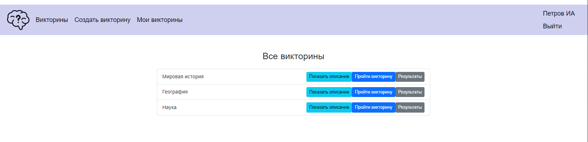
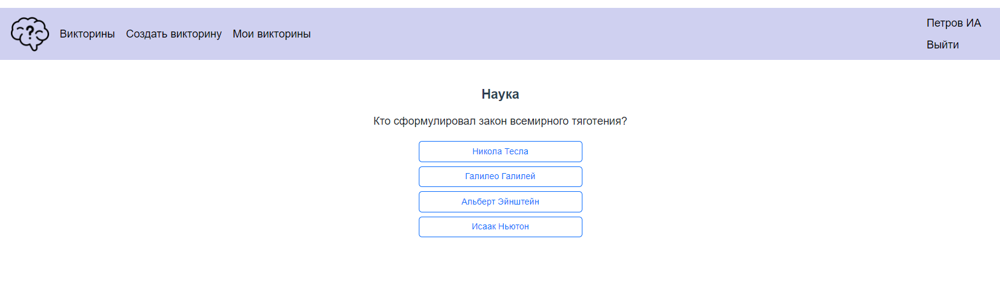
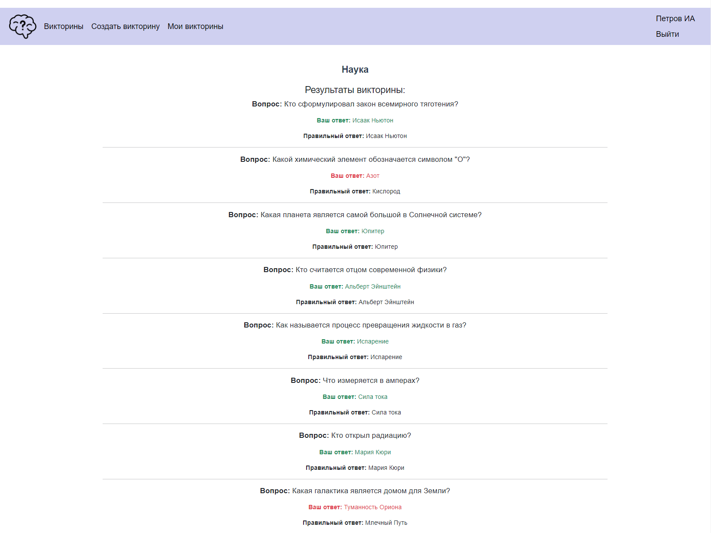
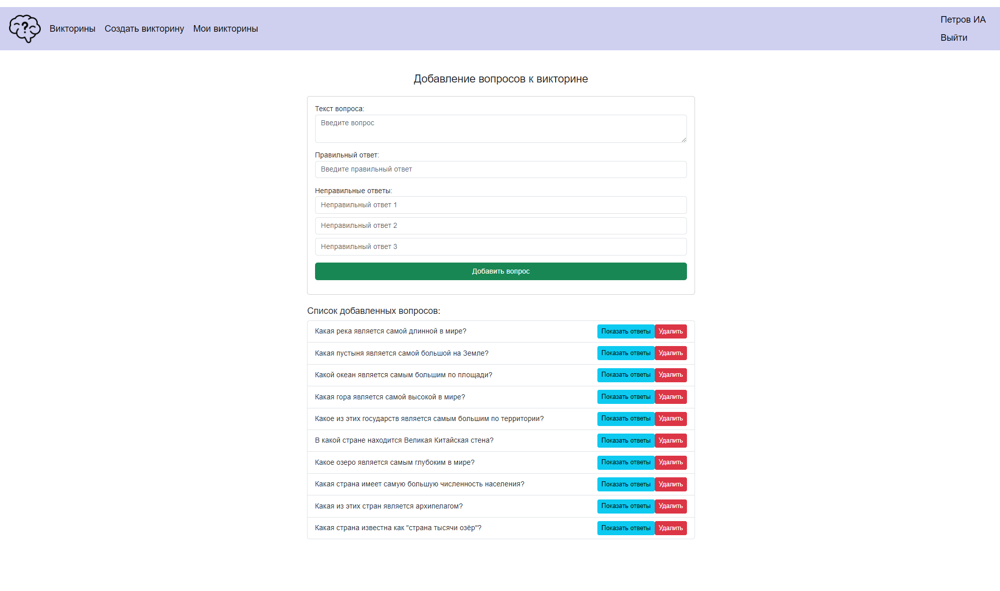
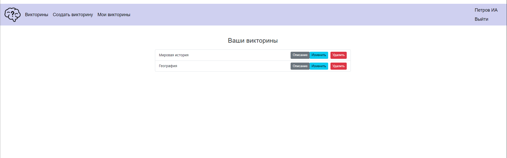

# 🎓 Курсовая работа: Веб-приложение для организации викторин

Это веб-приложение разработано на **Node.js и Vue.js** и предназначено для создания и прохождения викторин.  
Пользователи системы могут регистрироваться, участвовать в викторинах, создавать свои викторины и просматривать результаты.

---

## 📝 Основные функции

- Регистрация и авторизация пользователей
- Просмотр списка доступных викторин
- Прохождение викторин
- Просмотр результатов своей викторины и других пользователей
- Создание новых викторин и вопросов (для авторизованных пользователей)

---

## 🖼️ Скриншоты

### 1. Страница авторизации

### 2. Список викторин

### 3. Прохождение викторины

### 4. Итоги викторины

### 5. Результаты других пользователей

### 6. Создание новой викторины

### 7. Добавление вопросов в викторину

### 8. Список своих викторин

